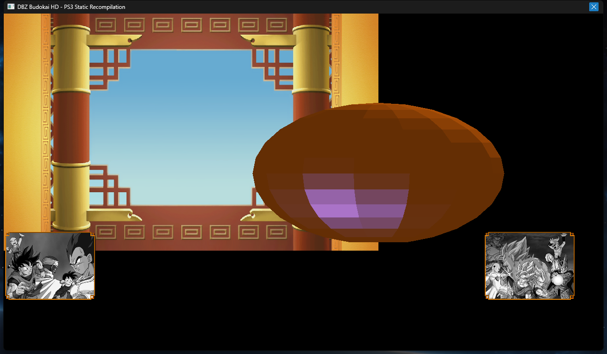

# dbz-budokai-hd — PS3 Static Recompilation Port

A work-in-progress static recompilation of **Dragon Ball Z: Budokai HD Collection** (`EBOOT.elf`, PS3 / BLES01658) to a native Windows x64 executable.

Built on top of the **[ps3recomp](https://github.com/sp00nznet/ps3recomp) SDK** — a PS3 PowerPC → C++ static recompilation framework.

> **This is a fork / game port built on ps3recomp.**  
> See the SDK repo for the recompiler pipeline, HLE library implementations, and runtime core.

---

## What this repo contains

| File/Dir | Description |
|---|---|
| `main.cpp` | Host entry point: reserves 4 GB guest VA, loads the ELF, applies game-specific patches, calls `_start`; Win32 display window thread (1280×720 DIB) |
| `runtime_glue.cpp` | `vm_base`, `vm_read/write*` helpers, `lv2_syscall` dispatcher, `ps3_indirect_call`; RSX FIFO parser; software rasterizer; background texture loader |
| `extra_funcs.cpp` | Hand-lifted PPU functions missed by the lifter (C++ ctors/dtors reached via indirect CTR calls) |
| `stubs.cpp` | Reference template for NID overrides (not compiled; documentation only) |
| `spu_interp.cpp` | SPU instruction interpreter — covers full SPURS kernel + EDGE geometry processor opcode set |
| `spu_spurs.cpp` | SPURS/SPU orchestration: loads kernel ELF, LS patches, burst execution loop, EDGE workload dispatch, animated sphere generator |
| `recompiled/ppu_recomp.cpp` | **Auto-generated** by `ppu_lifter.py` from `EBOOT.elf` — contains all lifted PPU functions (with manual diagnostic/guard patches) |
| `recompiled/ppu_recomp.h` | **Auto-generated** — declares `ppu_context`, memory helpers, all `func_XXXXXXXX` prototypes |
| `config.toml` | Lifter configuration: input ELF, output dir, HLE/LLE module choices |
| `CMakeLists.txt` | Build system (Ninja + MSVC) |
| `build_run.bat` | Configure + build via Ninja |
| `run.bat` | Run `build\dbz-budokai-hd.exe ..\game\EBOOT.elf` |

## What's not here (and why)

- **`EBOOT.elf`** and all game data — copyrighted by Bandai Namco / Spike Chunsoft. You must supply your own legally-obtained decrypted PS3 ELF and an original disc image.
- The `build/` directory — generated artifacts.

---

## Requirements

- Windows 10/11 x64
- Visual Studio 2022 (for MSVC + Windows SDK)
- CMake 3.20+, Ninja
- The ps3recomp SDK cloned alongside this repo (see layout below)
- A decrypted `EBOOT.elf` from *DBZ Budokai HD Collection* (BLES01658)
- The original disc image at `../BLES01658/` (for game asset loading)

## Directory layout expected

```
RecompLauncher/
└── ps3recomp/              ← SDK repo (https://github.com/sp00nznet/ps3recomp)
    ├── dbz-budokai-hd/     ← this repo (cloned here)
    ├── game/
    │   └── EBOOT.elf       ← your decrypted ELF (not included)
    └── BLES01658/          ← disc image (optional — for background textures)
        └── PS3_GAME/USRDIR/LAUNCH/data.afs
```

## Build & Run

**Working invocation (PowerShell):**

```powershell
cd E:\Games\RecompLauncher\ps3recomp\dbz-budokai-hd

# One-time configure (or after deleting build\):
cmd /c '"C:\Program Files\Microsoft Visual Studio\2022\Community\VC\Auxiliary\Build\vcvars64.bat" >nul 2>&1 && cmake -B build -G Ninja -S . -DPS3RECOMP_DIR=E:/Games/RecompLauncher/ps3recomp'

# Subsequent rebuilds:
cmd /c '"C:\Program Files\Microsoft Visual Studio\2022\Community\VC\Auxiliary\Build\vcvars64.bat" >nul 2>&1 && cmake --build build'

# Run:
.\build\dbz-budokai-hd.exe ..\game\EBOOT.elf
```

`vcvars64.bat` must be sourced inside the same `cmd` session as the `cmake` call — PowerShell's `&` does not propagate child env vars. Don't run MSVC from Git Bash; it mangles `/flag` arguments as paths.

If the cmake configure cache is stale, delete `build\CMakeCache.txt` and `build\CMakeFiles\` and reconfigure.

---

## Current status

| Phase | Status |
|---|---|
| ELF load + guest memory setup | ✅ Working |
| Static C++ constructors (via indirect CTR) | ✅ Working |
| SPURS / game-context initialization sequence | ✅ Working |
| SPURS workload state machine (states 2 → 21) | ✅ Working |
| LV2 sync primitives (semaphore, mutex, condvar, lwmutex, lwcond, event queue) | ✅ Working |
| `sys_ppu_thread_create` — all startup threads run | ✅ Working |
| C runtime startup → game main `func_00012420` | ✅ Working |
| Game main: sysmodule loads, cellGcmInit, display-buffer alloc | ✅ Working (GCM force-succeeded; null RSX backend) |
| **SPURS SPU kernel** (embedded ELF at 0x10BD00) | ✅ Running — 3000+ insns/cycle through full dispatch path |
| **EDGE SPU geometry library** (0x142900 + 0x14AE80) | ✅ Running — 15 slots dispatched; geometry processor functional |
| **EDGE MFC DMA pipeline** | ✅ Working — LS→LS GET + PUT to RSX IO region wired end-to-end |
| **Software rasterizer** | ✅ Working — depth-buffered, flat-shaded with Phong specular |
| **Animated sphere** | ✅ Rendering — UV sphere (341 triangles) rotating at 30fps via dedicated render thread |
| **Background cycling** | ✅ Working — cycles through 5 AFS backgrounds every 5 render frames (~1 s intervals) |
| **Game background textures** | ✅ Loaded — generic `#A3T` decoder; entry 15: 2048×1024 stage background; entries 12+13: 512×512 character art overlays |
| **SPU FP/conversion opcodes** | ✅ Complete — cuflt/csflt/cfltu/cflts, fesd/frds, rotqbyi, hbrr/hbrp; zero UNIMPL messages |
| Win32 display window (1280×720 DIB-backed) | ✅ Working — animated sphere + cycling backgrounds + overlays; 5-second hold after game exit |
| UpdateThread (bnusCore audio management) | ✅ Running — 16 ms idle stub |
| C++ destructor walker, clean process exit | ✅ Working |
| **Game loop** | 🔲 Not yet — game main is pure init; actual loop is SPURS/SPU-driven |
| Real game geometry (characters, stages) | 🔲 Next — needs SPURS mailbox signalling + real EDGE task descriptors |
| SPURS mailbox / `cellSpursAddWorkload` HLE | 🔲 Next — key to dispatching real game workloads |
| Audio (cellAudio) | 🔲 Stubbed |
| Input (cellPad) | 🔲 Stubbed |

### What you see when you run it

A 1280×720 window opens, animates for roughly 10–15 seconds, then holds for 5 seconds:

- **Background cycling**: 5 AFS intro screens (Bandai, Namco, SCEE, Spike Chunsoft logos + DBZ tournament stage) cycling every ~1 second
- **Bottom corners**: DBZ character group portrait art (entries 12 and 13, 512×512 de-swizzled BGRA8) alpha-blended as overlays
- **Centre-right**: a UV sphere (341 triangles) rotating continuously around the Y-axis, flat-shaded with diffuse + Phong specular, depth-buffered, warm orange-gold palette

The sphere animates at ~30fps from a dedicated render thread that runs independently of the SPURS dispatch cycle. The sphere represents EDGE geometry output — the same pipeline the game itself uses for character and stage rendering.



---

## Architecture overview

### Full EDGE rendering pipeline (working end-to-end)

```
PPU (main.cpp)
  └─ spurs_start() launches SPU kernel thread
       └─ SPURS kernel (LS[0xD0]) dispatches 15 workload slots
            └─ EDGE scheduler (LS[0x3050]) receives stop 0x3FFF
                 └─ Geometry processor (LS[0x3108]) runs vertex data
                      └─ MFC PUT → vm_base[0xD0100000]
                           └─ rsx_on_edge_write() → edge_rasterize_triangles()
                                └─ Win32 DIB window (rsx_present_frame)
```

### Software rasterizer (runtime_glue.cpp)

`edge_rasterize_triangles()` reads float4 big-endian vertices from guest memory at `0xD0100000`, projects them to 1280×720 screen space using standard NDC → pixel coordinates, then rasterizes each triangle with:
- Per-pixel barycentric z-interpolation + depth test (z-buffer)
- Flat face normals for per-triangle shading
- Diffuse (NdotL) + Phong specular (shininess=4) with a warm gold/orange colour palette

`frame_begin()` runs at the start of each EDGE frame: blits the background texture (nearest-neighbour scaled from 2048×1024 to 1280×720), then clears the z-buffer.

### Game asset loading (runtime_glue.cpp)

`load_a3t_entry()` is a generic `#A3T` texture decoder: it scans each entry's header for the embedded `CellGcmTexture` struct (located at `gcm_off + 0x68` bytes from the entry start), reads the format byte to determine R5G6B5 (0xA4/0x84) or A8R8G8B8 (0xA5/0x85), and converts to host BGRA8. Textures with bit 5 of the format byte clear (no LN flag) are stored in Z-order (Morton swizzle) and are de-swizzled using a bit-spread interleave before display.

`rsx_load_launch_background()` loads three textures on startup:
- **Entry 15** (2048×1024, A8R8G8B8-LN): the DBZ Budokai tournament stage — used as fullscreen background
- **Entry 12** (512×512, A8R8G8B8 swizzled): DBZ character group portrait — displayed as 256×256 overlay in the bottom-left corner
- **Entry 13** (512×512, A8R8G8B8 swizzled): second character group portrait — displayed in the bottom-right corner

The 16 entries in `LAUNCH/data.afs`: entry 0 is a `nusc` scene config; entries 1–14 are `#A3T` textures in R5G6B5 or A8R8G8B8 (not DXT5 as previously assumed); entry 15 is A8R8G8B8 BGRA8.

### SPURS/SPU kernel

The SPURS kernel ELF lives at guest address `0x10BD00`. It's loaded into a dedicated `spu_ctx_t` and runs on a Windows background thread. Key patches applied to its LS image at load time:
- `LS[0x17C]`: `ilh r2, 1` — bypasses a SPURS management-area type check (ceqi r2, r4, 8)
- `LS[0x03BC]`: `lnop` — bypasses `brhnz r36` dispatch-idle branch (r36 is the actual register, not r12 as older sources document)
- `LS[0x03C0]`: `lnop` — bypasses `brhnz r33` dispatch-idle branch (not r13)

Without the two lnop patches, the kernel idles at LS[0x298E0] waiting for a PPU mailbox signal (LV2 would normally restart it with workload data in r79/r77). With them, the kernel forces dispatch through all 15 workload slots unconditionally.

---

### Key PPU patches applied

- **Pool-manager sentinel self-links** at `0x27BBD4`, `0x27BC3C`, `0x27BCA4`
- **SPURS context stub** at `0x700000` — synthetic CellSpurs page with bits 0–1, 7, 13 set; sub-object at `0x700100`
- **SPURS workload dispatch chain** at `0x70A000` — intercepts `vm_write32(0x27F81C, 0)` and keeps the synthetic vtable→OPD chain alive
- **States-13/14 struct chain** at `0x70B000` — intercepts `vm_write32(0x27F814, 0)` during SPURS shutdown
- **SPURS state machine** `func_000379BC` — patched the `bctrl` in `loc_0003AE74` to call this directly (lifter emitted a trampoline to `func_00000030` instead); state advances 2→3→4→6→7→8→9→12→13→14→15→21
- **State 6 spin-wait skip** — forces `gpr[4]=7` in `loc_00037BF4` (on real PS3, an SPU task writes this externally)
- **State 15 completion** — manual writes in `loc_00038194`: `[0x28B050]=21`, `[0x27F830]=1`
- **GCM force-successes** — `func_0004370C`, `func_00040C0C`, `func_00040BD4` patched to early-return 0 (RSX context pointer at `TOC[-0x7FA0]` is null without a real GPU)
- **RSX REF null backend** — discards writes to guest address `0x4` so the game's RSX-sync spin doesn't loop forever
- **`func_000F205C` HLE stub** — sysPrxForUser NID `0xA2C7BA64`; calls `func_00012420` with a re-entrant-call guard
- **`bcctrl` → `func_00000030` direct calls** — several `bctrl` instructions targeting `0x30` (the LV2 gate) were lifted as trampolines that returned early; replaced with direct calls so execution continues after each LV2 syscall

### Lifter bugs fixed by hand

**Dropped `stwu r1, -N(r1)` prologues (SP runaway):**

- `func_000379BC` — epilogue `+= 0xE0`; prologue patched in-place in `ppu_recomp.cpp`
- `func_000EFD18` / `func_000EFD1C` — OPD for `sdu_yah_size_check` points 4 bytes before the lifted function (where the missing `stwu r1, -0xB0(r1)` would live); wrapper added in `extra_funcs.cpp`
- `func_000EFACC` / `func_000EFAD0` — same pattern; missing `stwu r1, -0xC0(r1)` for `sdu_yah_all_list_delete`

**Dropped `addc rD, rA, rB` instructions (~770 sites):** The lifter emitted `/* TODO: addc ... */` for the carry-producing add. All sites filled with `(uint64_t)(uint32_t)rA + (uint64_t)(uint32_t)rB`.

See `CLAUDE.md` for full diagnostic recipes.

---

## What's next

1. **SPURS mailbox signalling** — remove the lnop bypass patches at `LS[0x03BC]`/`[0x03C0]` and implement proper PPU→SPU mailbox: when the kernel hits `stop 0` at `LS[0x298E0]`, restart it from entry `0xD0` with `r79`/`r77` populated with workload availability data. This lets the kernel dispatch real game workloads instead of the synthetic forced-dispatch path.

2. **`cellSpursAddWorkload` HLE** — populate the SPURS management area at `0x70A000` with real workload descriptors and signal the kernel via the inbound mailbox. This is the key to dispatching real EDGE tasks with actual character and stage geometry.

3. **More game textures** — `LAUNCH/data.afs` has 16 entries: entries 2–7 are 2048×1024 R5G6B5 (likely character-select stage art, ~5 MB each); entries 8–14 are various smaller BGRA8 UI elements. All are decodable with the existing `load_a3t_entry()` — just need to display them.

---

## Acknowledgements

- **ps3recomp SDK** — the recompiler pipeline and HLE runtime this port is built on
- Inspired by the broader static recompilation scene (N64Recomp, zelda64recomp, etc.)
